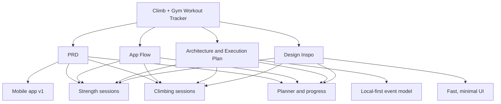

# Climb + Gym Workout Tracker

## Graph Index

- [PRD](Docs%20for%20reference/PRD%20v1.md): product scope, target users, navigation, core v1 feature set
- [App Flow](Docs%20for%20reference/User_Journeys.md): strength, climbing, planner, resume, and template creation journeys
- [Design Inspo](Docs%20for%20reference/Design%20Inspo.md): prompt-based UI direction for navigation, sessions, summaries, and dashboards
- [Architecture & Execution Plan](Docs%20for%20reference/Architecture.md): local-first event model, grade data, planner rules, and build order

## Relationship Notes

- `PRD` defines what the app is meant to do.
- `App Flow` turns those requirements into concrete user journeys.
- `Architecture & Execution Plan` defines how the flows persist and scale.
- `Design Inspo` shapes the UI for the same core surfaces in the other docs.
