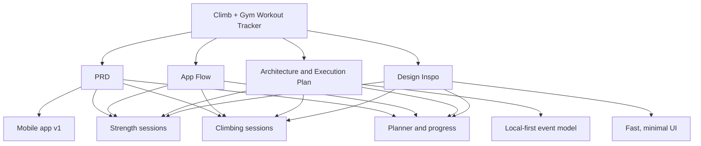
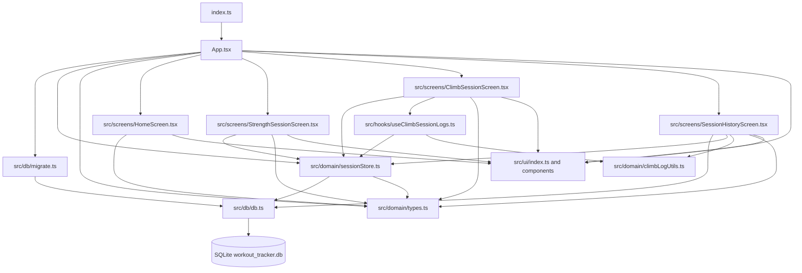

# Climb + Gym Workout Tracker

## Graph Index

- [PRD](Docs%20for%20reference/PRD%20v1.md): product scope, target users, navigation, core v1 feature set
- [App Flow](Docs%20for%20reference/User_Journeys.md): strength, climbing, planner, resume, and template creation journeys
- [Design Inspo](Docs%20for%20reference/Design%20Inspo.md): prompt-based UI direction for navigation, sessions, summaries, and dashboards
- [Architecture & Execution Plan](Docs%20for%20reference/Architecture.md): local-first event model, grade data, planner rules, and build order

## Relationship Notes

- `PRD` defines what the app is meant to do.
- `App Flow` turns those requirements into concrete user journeys.
- `Architecture & Execution Plan` defines how the flows persist and scale.
- `Design Inspo` shapes the UI for the same core surfaces in the other docs.

## Repo Graph

## Runtime Map

- `index.ts` registers `App.tsx` as the Expo root component.
- `App.tsx` owns navigation state, runs `migrate()`, resumes active sessions, and routes between home, strength, climb, and history screens.
- `src/db/db.ts` is the SQLite wrapper; `src/db/migrate.ts` creates the local-first tables for sessions, events, gyms, grade maps, settings, and planned sessions.
- `src/domain/sessionStore.ts` is the core event-backed session layer: create sessions, append events, fetch active sessions, and load ordered event streams.
- `src/domain/climbLogUtils.ts` reduces climbing events into derived climb logs; `src/hooks/useClimbSessionLogs.ts` exposes that reducer to the climb UI.
- `src/ui` is the shared design system consumed by the screens.

## Current Codebase Shape

- Active app surfaces: `HomeScreen`, `StrengthSessionScreen`, `ClimbSessionScreen`, `SessionHistoryScreen`
- Domain core: `sessionStore`, `climbLogUtils`, `types`, `dateUtils`
- Persistence layer: `db`, `migrate`
- Shared UI primitives: buttons, cards, chips, list rows, metric cards, tokens
- Parked work in `src/_quarantine`: planner, analytics, settings, summaries, planner hooks/store
